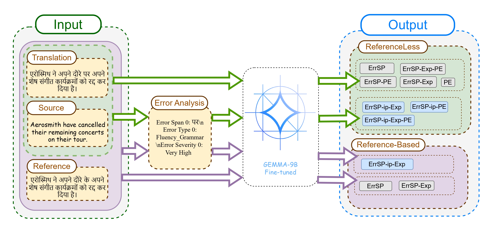

# Quality Estimation and Post-Editing Using LLMs For Indic Languages: How Good Is It?

This repository explores the use of Large Language Models (LLMs) like GPT-4 and Gemma-2 for machine translation evaluation, focusing on quality estimation (QE) and post-editing (PE) tasks in low-resource Indic languages. It includes fine-tuning setups, synthetic data generation, and performance benchmarks for both reference-based and reference-free scenarios.

---

## Synthetic Data Generation
We generate synthetic error explanations and post-edits using GPT-4, prompted with expert-annotated in-context examples. Our 3-shot prompting strategy significantly improves generation quality over zero-shot methods, enabling the fine-tuning of open-source LLMs for both reference-based and reference-free machine translation evaluation.  
The overall generation pipeline is illustrated in the figure below.

  

## Models

We fine-tune different variants of **Gemma-9B** on a range of tasks by modifying the inputs and outputs. These include generating **error spans**, **error explanations**, and **post-edits**, both with and without references. You can find the training pairs [here](Synthetic%20Data/).

### Fine-tuning Tasks

| **Model Name**      | **Inputs Provided**                              | **Outputs Expected**                         |
|---------------------|--------------------------------------------------|----------------------------------------------|
| **Reference-Based** |                                                  |                                              |
| ErrSp               | Source, Translation, Reference                   | Error Spans                                  |
| ErrSp–Exp           | Source, Translation, Reference                   | Error Spans + Explanations                   |
| ErrSp–ip–Exp        | Source, Translation, Reference, Error Spans      | Explanations                                 |
| **Reference-Free**  |                                                  |                                              |
| ErrSp               | Source, Translation                              | Error Spans                                  |
| ErrSp–Exp           | Source, Translation                              | Error Spans + Explanations                   |
| ErrSp–Exp–PE        | Source, Translation                              | Error Spans + Explanations + Post-Edits      |
| ErrSp–ip–Exp        | Source, Translation, Error Spans                | Explanations                                 |
| ErrSp–ip–Exp–PE     | Source, Translation, Error Spans                | Explanations + Post-Edits                    |
| ErrSp–ip–PE         | Source, Translation, Error Spans                | Post-Edits                                   |
| ErrSp–PE            | Source, Translation                              | Error Spans + Post-Edits                     |
| PE                  | Source, Translation                              | Post-Edits                                   |

---

### Task Overview

  

This diagram highlights the input-output configurations for different fine-tuning tasks under both reference-based and reference-free settings using Gemma-9B.
