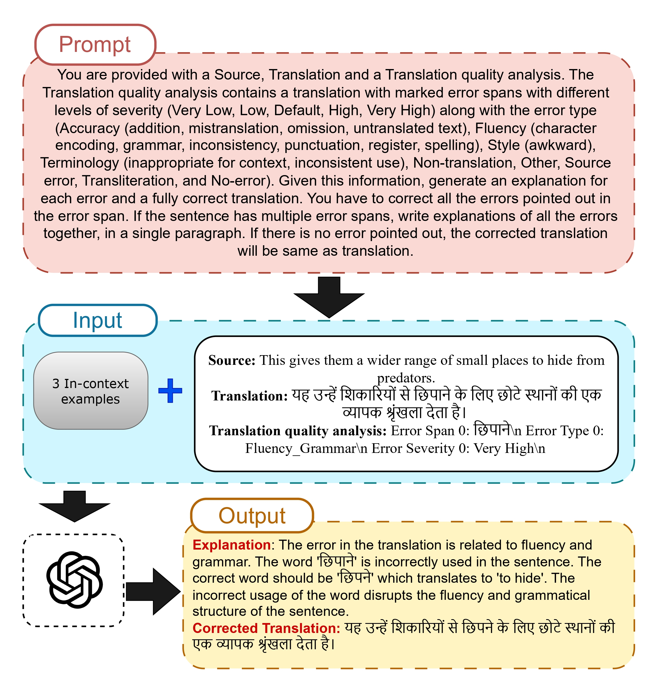

# Quality Estimation and Post-Editing Using LLMs For Indic Languages: How Good Is It?

This repository explores the use of Large Language Models (LLMs) like GPT-4 and Gemma-2 for machine translation evaluation, focusing on quality estimation (QE) and post-editing (PE) tasks in low-resource Indic languages. It includes fine-tuning setups, synthetic data generation, and performance benchmarks for both reference-based and reference-free scenarios.

---

## Synthetic Data Generation
We generate synthetic error explanations and post-edits using GPT-4, prompted with expert-annotated in-context examples. Our 3-shot prompting strategy significantly improves generation quality over zero-shot methods, enabling the fine-tuning of open-source LLMs for both reference-based and reference-free machine translation evaluation.  
The overall generation pipeline is illustrated in the figure below. You can find the generated training pairs [here](Synthetic%20Data/).

  

## Models
